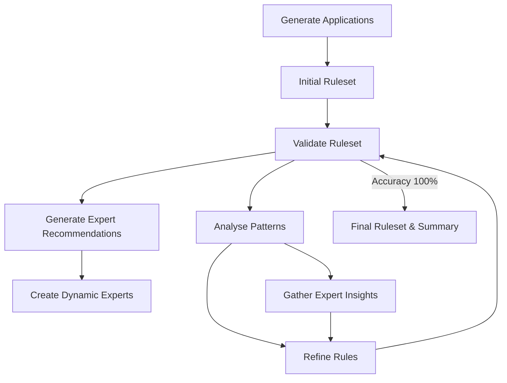

# Credit Card Approval Rule Discovery System

An AI-driven system that uses Large Language Models (LLMs) to discover and refine optimal credit card approval rules through iterative learning and specialised expert insights.

## Overview

This system demonstrates how LLMs can learn domain-specific rules by analysing patterns in data and leveraging specialised expertise. It discovers credit card approval rules through an iterative process, incorporating feedback from multiple specialised agents until achieving high accuracy.

## Features

- **Autonomous Rule Discovery** - Discovers approval rules from application examples
- **Iterative Refinement** - Improves rules across multiple cycles until reaching high accuracy
- **Dynamic Expert Integration** - Generates specialised expert agents that provide domain-specific insights
- **Comprehensive Validation** - Tests rules against applications with detailed diagnostics
- **LLM-Powered Analysis** - Leverages LLMs to analyse patterns and refine rules
- **Visual Progress Tracking** - Generates charts and visualisations of accuracy improvements

## Components

The system consists of these specialised components:

1. **Validator** - Tests rules against applications and measures accuracy
2. **Rule Analyser** - Examines applications to identify distinguishing patterns
3. **Rule Refiner** - Creates improved rules based on analysis and validation feedback
4. **Expertise Recommender** - Identifies needed domain expertise and generates expert configurations
5. **Expert Manager** - Creates and coordinates dynamic experts based on recommendations
6. **Dynamic Experts** - Specialised agents focusing on specific aspects (credit history, income stability, etc.)
7. **Summary Generator** - Creates comprehensive reports with visualisations

## Getting Started

### Prerequisites

- Python 3.8+
- OpenAI API key

### Installation

1. Clone the repository:
```bash
git clone https://github.com/xwrx-io/meta-agent.git
cd meta-agent
```

2. Create a virtual environment:
```bash
python -m venv .venv
source .venv/bin/activate  # On Windows: .venv\Scripts\activate
```

3. Install dependencies:
```bash
pip install -e .
```

4. Set up your OpenAI API key:
```bash
echo "OPENAI_API_KEY=your-api-key-here" > .env
```

### Running the System

1. Generate application data:
```bash
python data_generation.py
```
This creates 20 credit card applications with clear approval patterns.

2. Run the rule discovery system:
```bash
python meta_agent_system/main.py
```

3. Command-line options:
```bash
# Start with a minimal ruleset (true "from scratch" approach)
python meta_agent_system/main.py --from-scratch

# Set a custom maximum number of iterations (default is 10)
python meta_agent_system/main.py --max-iterations 15

# Combine multiple options
python meta_agent_system/main.py --from-scratch --max-iterations 20
```

4. View results:
Results are saved to the `data/results/` directory, including:
- Final ruleset in `credit_card_approval_rules.json`
- Validation metrics in `validation_history.json`
- Accuracy visualisation in `accuracy_improvement_[timestamp].png`
- Expert recommendations in `expertise_recommendations_[timestamp].json`
- Expert insights in `expert_insights_iteration_[N].json`
- Expert contributions in `expert_contributions_iteration_[N].json`
- Comprehensive summary in `run_summary_[timestamp].txt`

## How It Works

### Rule Discovery Process



1. **Application Generation** - Creates credit applications with various attributes
2. **Initial Ruleset** - Starts with a minimal ruleset when using `--from-scratch` or default ruleset
3. **Validation** - Tests rules against applications and measures accuracy
4. **Expert Recommendation** - After first iteration, recommends specialised expert types
5. **Dynamic Expert Creation** - Creates specialised agents for different aspects of credit assessment
6. **Pattern Analysis** - Examines approved, declined, and misclassified applications
7. **Expert Insights** - Dynamic experts provide specialised domain-specific recommendations
8. **Rule Refinement** - Creates improved rules based on validation feedback, pattern analysis, and expert insights
9. **Iteration** - Continues until reaching 100% accuracy or maximum iterations

### Dynamic Experts System

The system creates specialised experts after the first iteration:

1. **Expertise Recommender** analyses initial results to identify needed expertise
2. **Expert Manager** creates and coordinates dynamic experts
3. **Dynamic Experts** provide specialised insights in their domain:
   - Credit History Evaluator
   - Income Tier Analyser
   - Debt-to-Income Ratio Specialist
   - Employment Stability Assessor
   - etc.
4. These experts analyse applications and provide recommendations that help the Rule Refiner create more accurate rules

### Rule Structure

Rules follow a nested logical structure:
```json
{
  "logic": "any",
  "rules": [
    {
      "field": "creditHistory.creditTier",
      "condition": "equals",
      "threshold": "Excellent"
    },
    {
      "logic": "all",
      "rules": [
        {
          "field": "financialInformation.incomeTier",
          "condition": "in",
          "values": ["High", "Very High"]
        },
        {
          "field": "financialInformation.debtTier",
          "condition": "equals",
          "threshold": "Low"
        }
      ]
    }
  ]
}
```

## Project Structure

- `meta_agent_system/`: Core system code
  - `main.py`: Entry point of the application
  - `core/`: Core framework components
    - `expert_agent.py`: Base class for expert agents
    - `expert_factory.py`: Creates dynamic experts
    - `expert_manager.py`: Manages dynamic experts
    - `summary_generator.py`: Generates comprehensive reports
  - `experts/`: Expert modules
    - `validator.py`: Validates ruleset against applications
    - `rule_analyzer.py`: Analyses patterns in applications
    - `rule_refiner.py`: Refines rules based on feedback
    - `expertise_recommender.py`: Recommends needed expertise
    - `misclassification_analyzer.py`: Analyses edge cases
  - `llm/`: LLM integration components
  - `utils/`: Helper utilities
- `data/`: Data storage
  - `applications/`: Generated credit card applications
  - `results/`: Output files and visualisations
- `data_generation.py`: Creates sample credit card applications

## Key Insights and Learnings

### Effective LLM Teaching Techniques
- **Example-Based Learning**: LLMs learn better from concrete examples than abstract descriptions
- **Specialised Expertise**: Domain-specific experts provide focused insights in their area
- **Multi-agent Collaboration**: Different experts working together achieve better results than generalists
- **Explicit Feedback**: Showing both correct classifications and mistakes with explanations

### System Architecture Principles
- **Focused Prompts**: Clear, specific instructions perform better than open-ended ones
- **Dynamic Expertise**: System adapts by creating specialised agents as needed
- **Feedback Integration**: Multiple sources of feedback (validation, experts) are combined
- **Agentic Workflow**: Independent experts focus on their specialties and collaborate

## Customisation

### Modifying Application Generation

To change how applications are generated:
1. Edit `data_generation.py`
2. Adjust the approval criteria in the `should_approve()` function
3. Change the number of applications by modifying generation parameters
4. Run `python data_generation.py` to generate new applications

### Extending the System

You can extend this approach to other domains by:
1. Creating domain-specific data generators
2. Adjusting the rule format to match domain requirements
3. Customising validation criteria and expert recommendations
4. Adding new types of specialised experts

## Licence

[MIT Licence](LICENSE)
