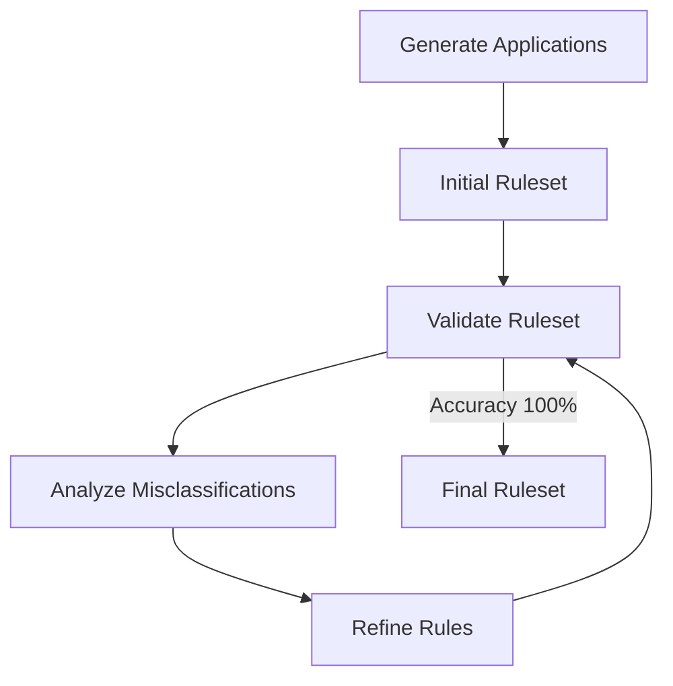

# Credit Card Approval Rule Discovery System

An AI-driven system that uses Large Language Models to discover and refine optimal credit card approval rules through iterative learning.

## Overview

This system demonstrates how LLMs can learn domain-specific rules by analyzing patterns in data. It focuses on discovering the rules that determine credit card application approvals and rejections, improving iteratively until it achieves high accuracy.

## Key Insights and Learnings

### Data Quality Over Quantity
- **Clear Patterns**: Systems learn better from fewer examples with obvious patterns
- **Category Distinction**: Clear separation between approval/rejection categories is crucial
- **Simplified Factors**: Focus on high-level tier classifications rather than raw numbers

### Effective LLM Teaching Techniques
- **Example-Based Learning**: LLMs learn better from concrete examples than abstract descriptions
- **Explicit Feedback**: Showing both correct classifications and mistakes with explanations
- **Guided Discovery**: Direct attention to the most important patterns and edge cases

### System Architecture Principles
- **Focused Prompts**: Clear, specific instructions perform better than open-ended ones
- **Incremental Complexity**: Start simple and gradually introduce more complex patterns
- **Feedback Loops**: Store and utilize previous results to avoid regression

### LLM Capabilities and Limitations
- **Pattern Recognition**: LLMs excel at identifying patterns when properly guided
- **Structured Learning**: They require well-structured examples and constraints
- **Reasoning Support**: Provide context and rationale rather than expecting independent discovery

## Components

The system consists of these specialized experts:

1. **Validator**: Tests rules against applications and measures accuracy
2. **Rule Analyzer**: Examines applications to identify distinguishing patterns
3. **Rule Refiner**: Creates improved rules based on analysis and validation feedback
4. **Misclassification Analyzer**: Investigates edge cases and persistent errors

## Getting Started

### Prerequisites

- Python 3.8+
- OpenAI API key

### Installation

1. Clone the repository:
```bash
git clone https://github.com/xwrx-io/meta-agent.git
cd meta-agent
```

2. Create a virtual environment:
```bash
python -m venv venv
source venv/bin/activate  # On Windows: venv\Scripts\activate
```

3. Install dependencies:
```bash
pip install -r requirements.txt
```

4. Set up your OpenAI API key:
```bash
echo "OPENAI_API_KEY=your-api-key-here" > .env
```

### Running the System

1. Generate application data:
```bash
python data_generation.py
```
This creates 20 credit card applications with clear approval patterns.

2. Run the rule discovery system:
```bash
python meta_agent_system/main.py
```
The system will process through multiple iterations, each refining the ruleset to improve accuracy.

3. To customize the execution:
```bash
# Start with an LLM-generated ruleset instead of default rules
python meta_agent_system/main.py --from-scratch

# Set a custom maximum number of iterations (default is 10)
python meta_agent_system/main.py --max-iterations 15

# Combine multiple options
python meta_agent_system/main.py --from-scratch --max-iterations 20
```

4. View results:
Results and visualizations are saved to the `data/results/` directory, including:
- Final ruleset in `credit_card_approval_rules.json`
- Validation metrics in `validation_history.json`
- Accuracy visualization in `accuracy_improvement_[timestamp].png`

## Customization

### Modifying Application Generation

To change how applications are generated:
1. Edit `data_generation.py`
2. Adjust the approval criteria in the `should_approve()` function
3. Change the number of applications by modifying `application_count`
4. Run `python data_generation.py` to generate new applications

### Tuning the Learning Process

To optimize the learning process:
1. Adjust LLM prompts in `meta_agent_system/experts/rule_refiner.py`
2. Change the application number in `data_generation.py` (20-30 recommended)
3. Modify the maximum iterations in `meta_agent_system/main.py`
4. Use `--from-scratch` flag to experiment with different initial rulesets

## How It Works

### Rule Discovery Process



1. **Application Generation**: Creates credit applications with various attributes
2. **Initial Ruleset**: Starts with predefined rules or LLM-generated rules (when using `--from-scratch`)
3. **Validation**: Tests rules against applications and measures accuracy
4. **Pattern Analysis**: Examines approved, declined, and misclassified applications
5. **Rule Refinement**: Creates improved rules based on observed patterns
6. **Iteration**: Continues until reaching high accuracy or maximum iterations

### Effective Rule Structure

Rules follow a nested logical structure:
```json
{
  "logic": "any",  // Top level combines rules with OR logic
  "rules": [
    {
      "field": "creditHistory.creditTier",
      "condition": "equals",
      "threshold": "Excellent"
    },
    {
      "logic": "all",  // Nested group combines with AND logic
      "rules": [
        {
          "field": "financialInformation.incomeTier",
          "condition": "in",
          "values": ["High", "Very High"]
        },
        {
          "field": "financialInformation.debtTier",
          "condition": "equals",
          "threshold": "Low"
        }
      ]
    }
  ]
}
```

## Project Structure

- `meta_agent_system/`: Core system code
  - `main.py`: Entry point of the application
  - `experts/`: Expert modules (validator, analyzer, refiner)
  - `llm/`: LLM integration
  - `utils/`: Helper utilities
- `data/`: Data storage
  - `applications/`: Generated credit card applications
  - `results/`: Output files and visualizations
- `data_generation.py`: Creates sample credit card applications

## Best Practices for LLM-Driven Rule Learning

1. **Clear Examples**: Provide concrete examples of both correct and incorrect classifications
2. **Structured Data**: Use categorical data (tiers) when possible
3. **Focused Feedback**: Emphasize edge cases that are being misclassified
4. **Simple Logic**: Start with simple logical structures and gradually increase complexity
5. **Iterative Learning**: Allow multiple refinement cycles with clear performance metrics

## Extending the System

You can extend this approach to other domains by:
1. Creating domain-specific data generators
2. Adjusting the rule format to match domain requirements
3. Customizing the validator for domain-specific success criteria

## License

[MIT License](LICENSE)
