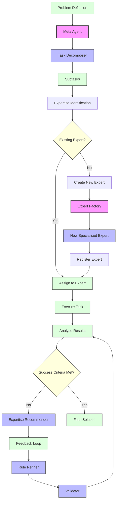

# Meta Agent System

A solution for solving complex problems using a meta-agent approach with dynamically created specialised expert agents.

## Overview

This system uses a meta-agent that coordinates multiple expert agents to solve complex problems. The meta-agent decomposes problems into subtasks, identifies the expertise needed for each subtask, and either assigns tasks to appropriate existing expert agents or dynamically creates new specialised agents as required.

## Key Features

- **Task Decomposition**: Breaks complex problems into manageable subtasks
- **Dynamic Expert Creation**: Creates specialised expert agents on demand based on required expertise
- **Feedback Loop**: Implements an iterative improvement cycle with validation and refinement
- **Success Criteria**: Automatically determines when a solution is satisfactory
- **Expertise Recommendation**: Identifies when new types of expertise might improve results
- **Enhanced Metrics & Visualization**: Generates comprehensive run summaries with accuracy metrics and visualizations
- **Complete System Prompts**: Shows the full system prompts used for new expert agents
- **Dynamic Testing & Validation**: Tracks rule evolution and improvements over iterations

## Example Problem: Credit Card Approval Rules Discovery

The system can discover the ruleset used for approving or declining credit card applications by analysing sample applications without prior knowledge of which ones were approved or declined.

The process works as follows:
1. Create a JSON schema for credit card applications
2. Generate sample applications (10 approved, 10 declined)
3. Analyse applications to identify patterns
4. Extract rules that determine approval or rejection
5. Validate rules against all applications
6. Refine rules iteratively until 100% accuracy is achieved

## Getting Started

### Prerequisites

- Python 3.8+
- OpenAI API key

### Installation

1. Clone the repository:
```bash
git clone https://github.com/xwrx-io/meta-agent.git
cd meta-agent
```

2. Create a virtual environment:
```bash
python -m venv venv
source venv/bin/activate  # On Windows: venv\Scripts\activate
```

3. Install the package using setup.py (recommended):
```bash
pip install -e .
```

   Alternatively, you can install from requirements.txt:
```bash
pip install -r requirements.txt
```

4. Set up your OpenAI API key:
```bash
echo "OPENAI_API_KEY=your-api-key-here" > .env
```

### Running the System

To run the meta agent on the credit card rules discovery problem:

```bash
python meta_agent_system/main.py
```

The system will generate a comprehensive summary at the end of the run, including:
- List of expert agents used (both initial and dynamically created)
- Complete system prompts for new expert agents
- Credit card application test results and validation statistics
- Evolution of rules from initial to final versions
- Visualization of accuracy improvements across iterations
- Runtime metrics and resource usage

Results and visualizations are saved to the `data/results/` directory.

### Testing

Run the end-to-end test:

```bash
python meta_agent_system/tests/test_end_to_end.py
```

## Project Structure

- `config/`: Configuration settings
- `core/`: Core components (meta-agent, tasks, experts)
- `data/`: Data storage (schemas, applications, results)
- `experts/`: Expert agent implementations
- `llm/`: LLM integration
- `utils/`: Utility functions
- `tests/`: Test scripts

## How It Works

### Meta Agent Architecture

The meta agent uses a priority queue to manage tasks and delegates them to specialised expert agents. When expertise is needed that no current agent possesses, the meta agent can dynamically create new expert agents with appropriate system prompts.



### Feedback Loop

The system implements a feedback loop for iterative improvement:
1. Extract rules based on data analysis
2. Validate rules against all applications
3. If success criteria aren't met, refine the rules
4. Repeat until success criteria are satisfied

### Expert Types

1. **Task Decomposer**: Breaks problems into subtasks and identifies required expertise
2. **Schema Designer**: Creates data schemas
3. **Data Generator**: Generates sample data
4. **Data Analyser**: Analyses patterns in data
5. **Rule Extractor**: Formulates rules from patterns
6. **Rule Refiner**: Improves rules based on validation feedback
7. **Validator**: Tests rules against criteria
8. **Expertise Recommender**: Suggests new expertise that might improve results

## Extending the System

You can extend the system by:
1. Creating new expert agents in the `experts/` directory
2. Updating the success criteria for different problem types
3. Adding new problem definitions

## License

[MIT License](LICENSE)
